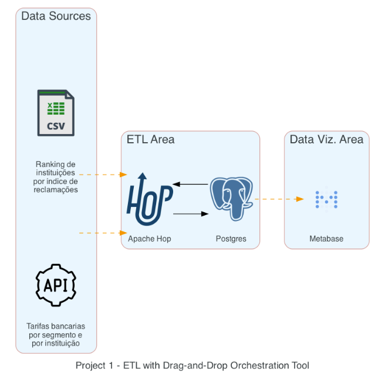
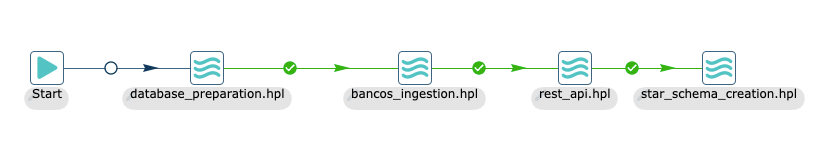
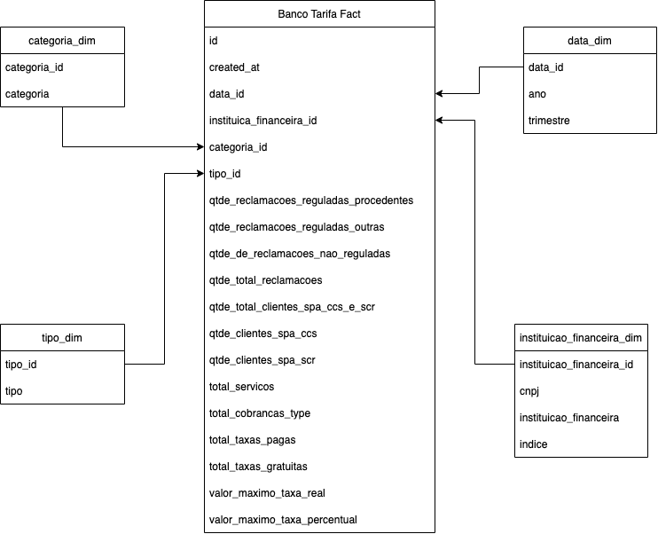
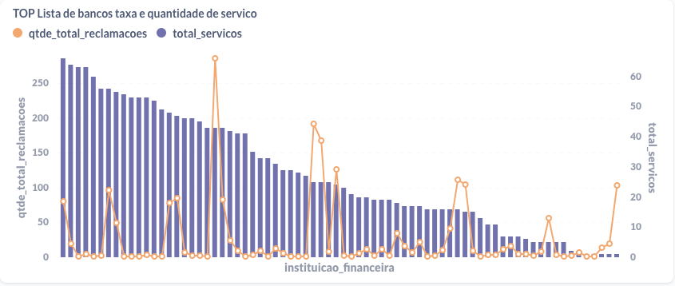
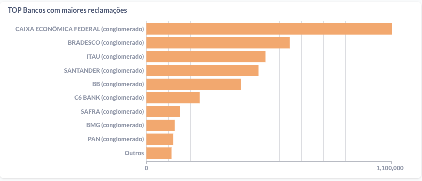
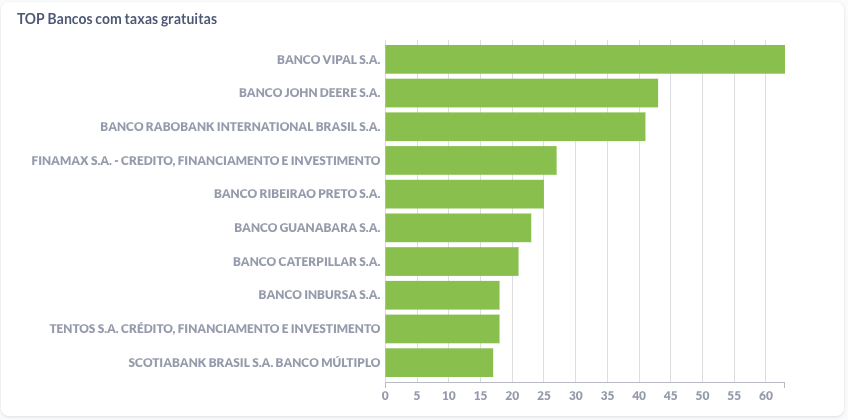

# Project 1 - Drag-And-Drop Orchestration Platform

## 1. Context
The main challenge is ingesting data from a CSV and API using a Visual/Drag-and-Drop orchestration platform, create a star-schema and display 3 graphs in a dashboard.

## 2. Project


Our solution includes the usage of three main technologies:
* Apache Hop: as the Drag-And-Drop Orchestration Platform
* Postgres: as our database to store the raw data and the star schema modeling
* Metabase: as our Data Visualization tool


The workflow designed in Apache Hop contains the following steps:

* **database_prepration.hpl**: A pipeline which execute a _DML_ script to generate the tables for the _source data_. Check the file `pg_dml/table_creation.sql` for more details.
* **bancos_ingestion.hlp**: A pipeline that reads the CSV in the path `hop_files/source_data/bancos.csv` and inserts the data in the table `bancos`
* **rest_api.hpl**: A pipeline that queries a information from the table `bancos` and then perform requests to an API. The result of each request is stored in a table  `lista_tarifas`.
* **star_schema_creation.hpl**: A pipeline which execute a script to create all the tables from the star schema model. Check the file `pg_dml/star_schema.sql` for more details.



The tables designed in the Star Schema was used to generate the following graphs in Metabase (Dashboard name: `star schema - bancos tarifa`):

* Relation between total of services provided by a bank and the number of complains/issues.



* TOP Banks with more complains/issues.




* TOP banks with free services (no fee).




## 3. How to Run

### 3.1 Apache Hop + Postgres + Metabase
#### 3.1.1 Requirements
- **[Docker](https://www.docker.com/)**
- **[Docker-compose](https://docs.docker.com/compose/)**

#### 3.1.2 Executing the project

On your terminal, execute the following cmd:
```sh
$ docker-compose up -d --build
```

#### 3.1.3 Acessing the services:

1. Apache Hop URL
```text
url: http://localhost:8080/ui
```

2. Metabase
```text
url: http://localhost:3000/

login: admin@teste.com.br
password: 123admin
```

### 3.2 Diagrams

#### 3.2.1 Requirements
- **[Diagram as code](https://diagrams.mingrammer.com/)**
- **[GraphViz](https://graphviz.gitlab.io/download/)**
- **[Python 3+](https://www.python.org/)**

#### 3.2.2 Generating the Diagram

On your terminal, execute the following cmd:
```sh
$ python architecture_diagram/architecture.py
```