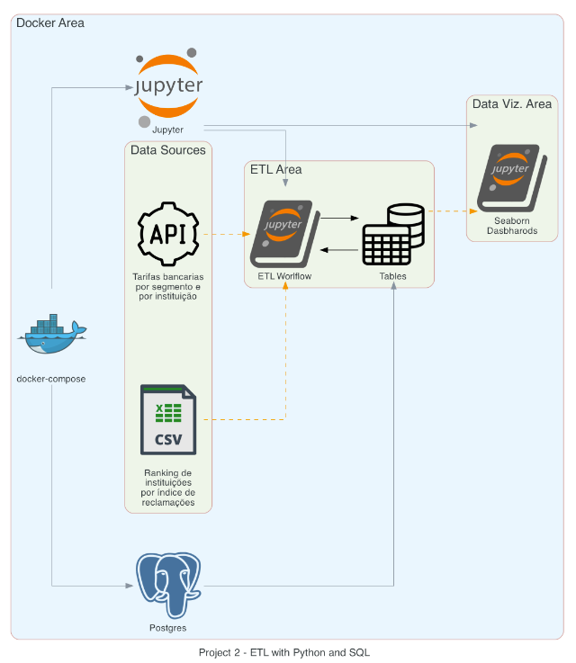
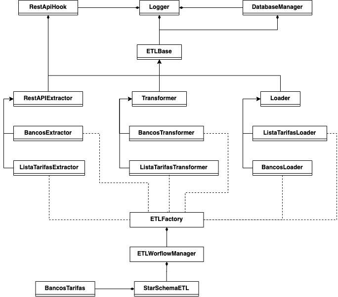
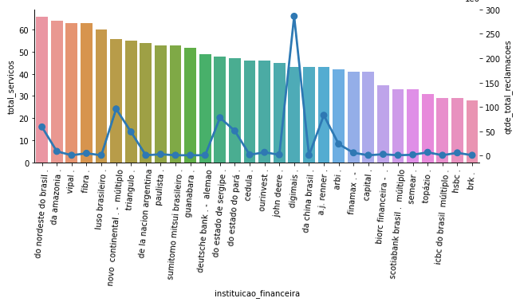
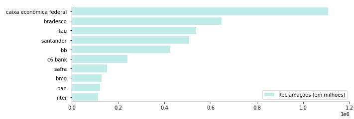
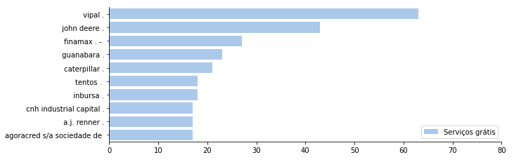

# Project 1 - Drag-And-Drop Orchestration Platform

## 1. Context
The main challenge is ingesting data from a CSV and API using a Visual/Drag-and-Drop orchestration platform, create a star-schema and display 3 graphs in a dashboard.

## 2. Project


Our solution includes the usage of three main technologies:
* **Jupyter**: as the Drag-And-Drop Orchestration Platform
* **Postgres**: as our database to store the raw data and the star schema modeling
* **Seaborn**: as our Data Visualization tool


The workflow designed in Jupyter contains the following steps:




The tables designed in the Star Schema was used to generate the following graphs in Seaborn (Dashboard name:`data_visualization.ipynb`):

* Relation between total of services provided by a bank and the number of complains/issues.



* TOP Banks with more complains/issues.




* TOP banks with free services (no fee).




## 3. How to Run

### 3.1 Jupyter + Postgres + Seaborn
#### 3.1.1 Requirements
- **[Docker](https://www.docker.com/)**
- **[Docker-compose](https://docs.docker.com/compose/)**

#### 3.1.2 Executing the project

On your terminal, execute the following cmd:
```sh
$ docker-compose up -d --build
```

#### 3.1.3 Acessing the services:

1. Jupyter
```text
url: http://localhost:8888/

Procedural Workflow ETL: http://localhost:8888/lab/tree/proc_etl_workflow.ipynb
Object Oriented Workflow ETL: http://localhost:8888/lab/tree/oo_etl_workflow.ipynb
Dashboard using Seaborn: http://localhost:8888/lab/tree/data_visualization.ipynb
```

### 3.2 Diagrams

#### 3.2.1 Requirements
- **[Diagram as code](https://diagrams.mingrammer.com/)**
- **[GraphViz](https://graphviz.gitlab.io/download/)**
- **[Python 3+](https://www.python.org/)**

#### 3.2.2 Generating the Diagram

On your terminal, execute the following cmd:
```sh
$ python architecture_diagram/architecture.py
```