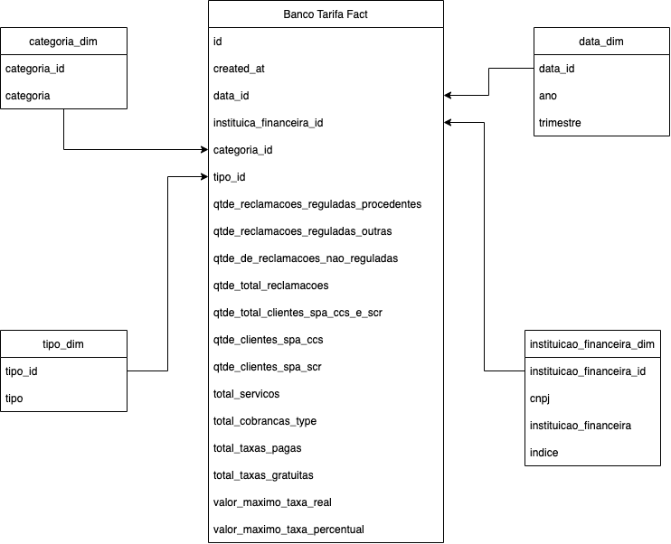

# Project 2 - ETL with Python and SQL

## 1. Context
The main challenge is ingesting data from a CSV and API using a Visual/Drag-and-Drop orchestration platform, create a star-schema and display 3 graphs in a dashboard.

## 2. Project

Our solution includes the usage of three main technologies:
* **Jupyter**: as the interactive platform to run python
* **Postgres**: as our database to store the raw data and the star schema modeling
* **Seaborn**: as our Data Visualization tool


The workflow designed in Jupyter contains the notebooks:

* **proc_etl_workflow**: This is the procedural implementation of the ETL process which consist in the following steps:
  ```
  Algorithm:
  1. Read and concat all the csv files of the Bank Issues csv
  2. Use the column "CNPJ IF" to make calls to the API and get the Bank Fee informations
  3. Normalize the data of Bank Issues csv
  4. Normalize the data of Bank Fee csv
  5. Save the Bank issues as table at Postgres
  6. Save the Bank Fee as table at Postgres
  7. Generate the Star Schema modeling of Bank Issues and Bank Fee (Image of the model below)
  ```


* **oo_etl_workflow**: This is the Object-Oriented workflow of the algorithm described in the **proc_etl_workflow**. The representation of the modeling can be checked in the diagram below:

  * **Logger**: A class that implements/configure a logger for the project
  * **RestApiHook**: A Hook for Rest API which implements the requests methods
  * **DatabaseManager**: A class specialized in perform actions in Postgres. Implements sql-alchemy
  * **ETLBase**: A base abstraction for the Extractor, Transformer and Loader classes. It simply implements the Logger class as composition and set a class-level attribute with the 'root' path of the 'filesystem'.
  * **RestApiExtractor**: An Abstract class for Extractor classes specialized in extract from Rest APIs 
  * **Transformer**: An Abstraction that sets the structure for a Transformer class which will be responsible to perform the transformation of the extracted data 
  * **Loader**: An Abstraction that sets the structure for a Loader class which will be responsible to Load/write data (extract, transformed) to the Database or the Filesystem.
  * **ETLFactory**: The ETLFactory is a implementation of Factory which is responsible for build the Extractors, Transformers and Loader classes.
  * **ETLWorkflowManager**: This class is responsible to perform the ETL actions. It basically implements the ETLFactory as composition and use it to get the ETL classes of the target entity_name and then execute their ETL.
  * **BancosTarifas**: A class created to generate the StarSchema based on the modeling proposed for the (Bancos) Bank Issues and (Lista Tarifas) Bank Fee data.
  * **StarSchemaETL**: It manages the build and execution of ETLWorkflowManager and BancosTarifas classes.


* **data_visualization**: It is the notebook which implements the seaborn and create the dashboards with the 3 graphs requested for this challenge. It serves both procedural and object-oriented notebooks.

  * **Relation between total of services provided by a bank and the number of complains/issues.**
  

  * **TOP Banks with more complains/issues.**
  
  
  * **TOP banks with free services (no fee).**
  


## 3. How to Run

### 3.1 Jupyter + Postgres
#### 3.1.1 Requirements
- **[Docker](https://www.docker.com/)**
- **[Docker-compose](https://docs.docker.com/compose/)**

#### 3.1.2 Executing the project

On your terminal, execute the following cmd:
```sh
$ docker-compose up -d --build
```

#### 3.1.3 Acessing the services:

1. Jupyter
```text
url: http://localhost:8888/

Procedural Workflow ETL: http://localhost:8888/lab/tree/proc_etl_workflow.ipynb
Object Oriented Workflow ETL: http://localhost:8888/lab/tree/oo_etl_workflow.ipynb
Dashboard using Seaborn: http://localhost:8888/lab/tree/data_visualization.ipynb
```

### 3.2 Diagrams

#### 3.2.1 Requirements
- **[Diagram as code](https://diagrams.mingrammer.com/)**
- **[GraphViz](https://graphviz.gitlab.io/download/)**
- **[Python 3+](https://www.python.org/)**

#### 3.2.2 Generating the Diagram

On your terminal, execute the following cmd:
```sh
$ python architecture_diagram/architecture.py
```