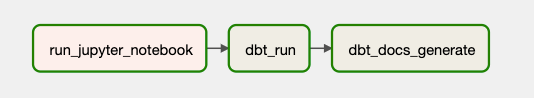
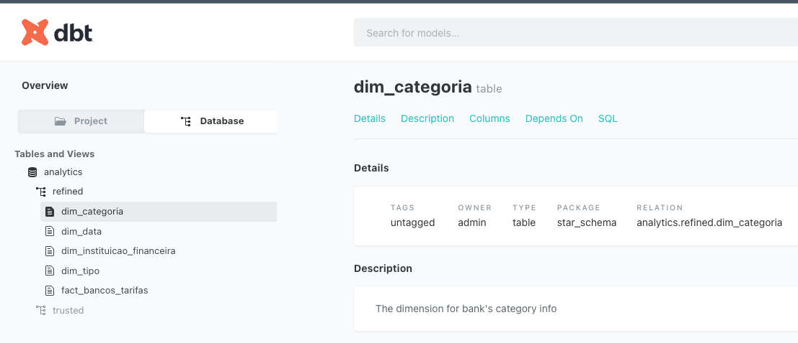

# Project 3 - ETL with Apache Airflow and DBT

## 1. Context
The main challenge is ingest data from a CSV and API using Apache Airflow, DBT to create a star-schema and display 3 graphs in a dashboard.

## 2. Project

Our solution includes the usage of five main technologies:
* **Jupyter**: as the interactive platform to run python
* **Jupyter Kernel Gateway**: as the API to execute jupyter notebook remotely
* **Postgres**: as the database to store the raw data and the star schema modeling
* **Seaborn**: as the data visualization tool
* **Apache Airflow**: as the scheduling and orchestration tool


At Apache Airflow, it was implemented a [DAG](airflow/dags/star_schema.py) called `star_schema.py` to perform the ETL. It has the following opereators:


* **run_jupyter_notebook**: A PythonOperator that executes a function which makes a request to the `jupyter_api` service in order to execute the `oo_etl_workflow.ipynb` notebook (check more details regarding this notebook [here](project-2/README.md)). The `jupyter_api` is a implementation of the **[Jupyter Kernel Gateway](https://jupyter-kernel-gateway.readthedocs.io/en/latest/)** which is a web server that provides headless access to Jupyter kernels making it possible to execute them through REST calls.


* **dbt_run**: It is a simple BashOperator that performs the [`dbt run` cmd](https://docs.getdbt.com/reference/commands/run) which will create the models in the **Analytics** database. Check the details of the Star Schema Model below.


* **dbt_docs_generate**: It is a simple BashOperator that performs the [`dbt_docs_generate` cmd](https://docs.getdbt.com/reference/commands/cmd-docs#dbt-docs-generate) that generates the artifact (catalog.json) that provides DBT documentation. This artifact is used by the web service `dbt_docs` that parse this artifact and provide a user-friendly interface to its content.



* **data_visualization**: It is the notebook which implements the seaborn and create the dashboards with the 3 graphs requested for this challenge. It serves both procedural and object-oriented notebooks.


  * **Relation between total of services provided by a bank and the number of complains/issues.**
  


  * **TOP Banks with more complains/issues.**
  
  

  * **TOP banks with free services (no fee).**
  


## 3. How to Run

### 3.1 Jupyter + Postgres
#### 3.1.1 Requirements
- **[Docker](https://www.docker.com/)**
- **[Docker-compose](https://docs.docker.com/compose/)**

#### 3.1.2 Executing the project

On your terminal, execute the following cmd:
```sh
$ docker-compose up -d --build
```

#### 3.1.3 Acessing the services:

1. Jupyter
```text
url: http://localhost:8888/

Object Oriented Workflow ETL: http://localhost:8888/lab/tree/oo_etl_workflow.ipynb
Dashboard using Seaborn: http://localhost:8888/lab/tree/data_visualization.ipynb
```

2. Airflow
```text
url: http://localhost:8888/

user: admin
pwd: admin
```

3. Dbt docs
```text
url: http://localhost:5000/
```

### 3.2 Diagrams

#### 3.2.1 Requirements
- **[Diagram as code](https://diagrams.mingrammer.com/)**
- **[GraphViz](https://graphviz.gitlab.io/download/)**
- **[Python 3+](https://www.python.org/)**

#### 3.2.2 Generating the Diagram

On your terminal, execute the following cmd:
```sh
$ python architecture_diagram/architecture.py
```