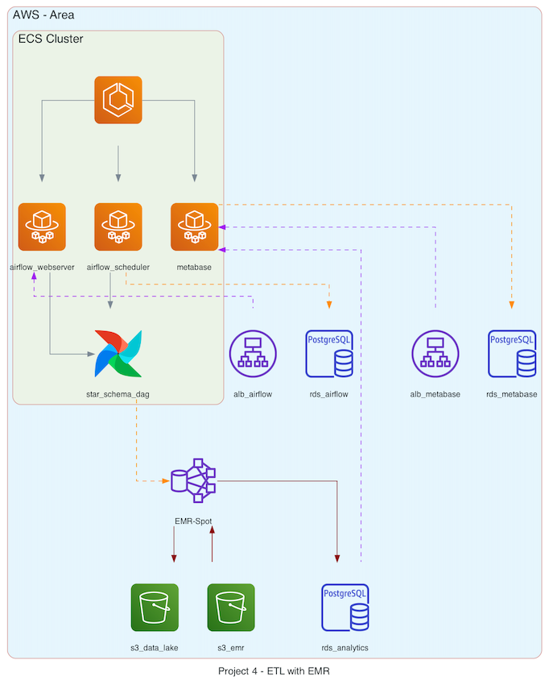
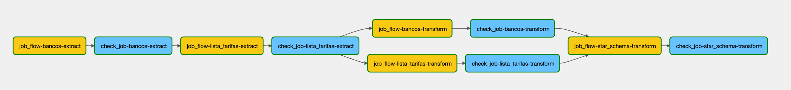
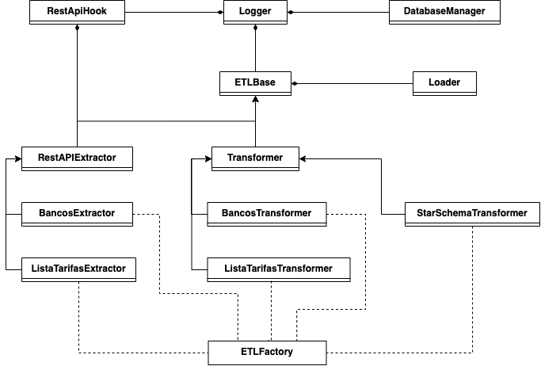
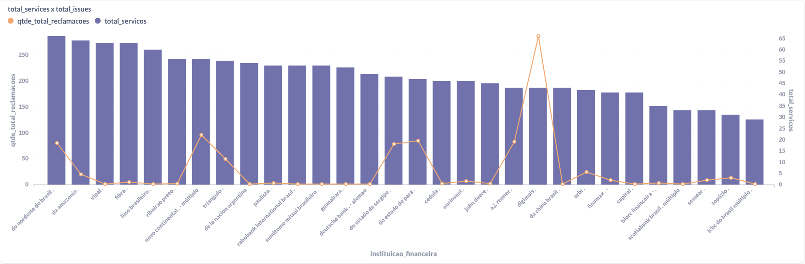
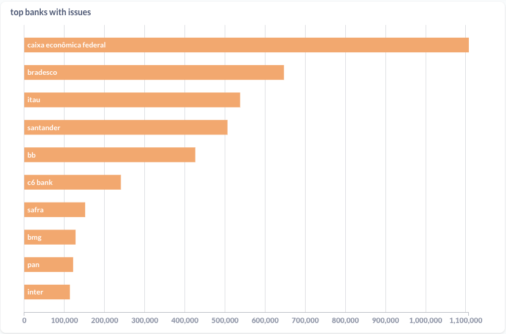
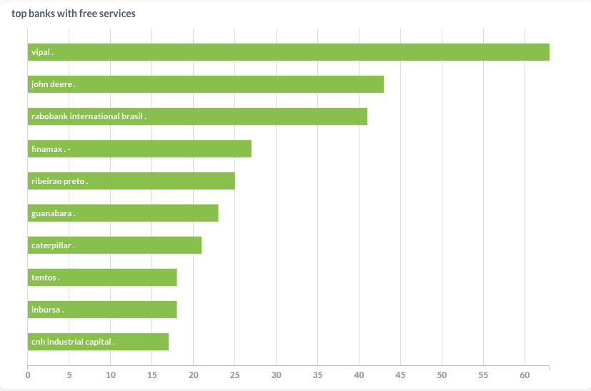

# Project 4 - ETL with Apache Airflow and EMR

## 1. Context
The main challenge is ingest data from a CSV and API using Apache Airflow and EMR to create a star-schema and display 3 graphs in a dashboard.

## 2. Project

Our solution includes the usage of five main technologies:
* **ECS**: As the platform to run our containers
* **EMR**: As the platform to run our processing codes
* **Spark**: as the main language to process the data
* **Metabase**: as the data visualization tool
* **Apache Airflow**: as the scheduling and orchestration tool




At Apache Airflow, it was implemented a [DAG](airflow/dags/star_schema.py) called `star_schema.py` to perform the ETL. It has the following opereators:



There are only two types of operators used in this class which are the [EmrCreateJobFlowOperator](https://registry.astronomer.io/providers/amazon/modules/emrcreatejobflowoperator) and [EmrJobFlowSensor](https://registry.astronomer.io/providers/amazon/modules/emrjobflowsensor). The first one will be responsible to create the EMR Spot instance and assign a Step to it. The second one will basically check if the execution succeeded or not, if it fails the Operator will fail as well, otherwise it will become green (success) and proceed to the next operator.

There is only one file that is being executed by all jobs on EMR which is the [emr/job_template.py](emr/job_template.py). Basically, this job is calling the ETLFactory class to build each class that will be executed in the EMR StepJob. In the image below you can check a diagram of how the `packages` directory is structured.


* **Logger**: A class that implements/configure a logger for the project
* **RestApiHook**: A Hook for Rest API which implements the requests methods
* **DatabaseManager**: A class specialized in perform actions in Postgres. Implements sql-alchemy
* **ETLBase**: A base abstraction for the Extractor, Transformer and Loader classes. It simply implements the Logger class as composition and set a class-level attribute with the 'root' path of the 'filesystem'.
* **RestApiExtractor**: An Abstract class for Extractor classes specialized in extract from Rest APIs
* **Transformer**: An Abstraction that sets the structure for a Transformer class which will be responsible to perform the transformation of the extracted data
* **Loader**: The Loader class will be responsible to load/write data (extracted, transformed) to the Database or the Filesystem.
* **ETLFactory**: The ETLFactory is a implementation of Factory which is responsible for build the Extractors, Transformers and Loader classes.


### Data Visualization
Using metabase it was generated the three following graphs:

  * **Relation between total of services provided by a bank and the number of complains/issues.**
  


  * **TOP Banks with more complains/issues.**
  
  

  * **TOP banks with free services (no fee).**
  


## 3. How to Run

### 3.1 Airflow + Metabase
#### 3.1.1 Requirements

* Local Environment
- **[Docker](https://www.docker.com/)**
- **[Docker-compose](https://docs.docker.com/compose/)**

* Development Environment
- **[Terraform v12+](https://www.terraform.io/)**


#### 3.1.2 Executing the project - Local Environment

On your terminal, execute the following cmd:
```sh
$ docker-compose up -d --build
```

#### 3.1.3 Acessing the services:

1. Jupyter
```text
url: http://localhost:8888/

Object Oriented Workflow ETL: http://localhost:8888/lab/tree/oo_etl_workflow.ipynb
Dashboard using Seaborn: http://localhost:8888/lab/tree/data_visualization.ipynb
```

2. Metabase
```text
url: http://localhost:3000/
```


#### 3.1.3 Executing the project - Development Environment

On your terminal, execute the following cmd:
```sh
$ source deploy.sh
```
This documentation is located in the root of the project-4 folder. It is basically doing the following actions:
* Asking for some required arguments (such as AWS_KEY and PASS info if it isn't set as environment variables)
* Executing terraform
* Sending some required files to the emr bucket on S3
* Building and pushing the airflow's docker image (check the Dockerfile) to ECR.


### 3.2 Diagrams

#### 3.2.1 Requirements
- **[Diagram as code](https://diagrams.mingrammer.com/)**
- **[GraphViz](https://graphviz.gitlab.io/download/)**
- **[Python 3+](https://www.python.org/)**

#### 3.2.2 Generating the Diagram

On your terminal, execute the following cmd:
```sh
$ python architecture_diagram/architecture.py
```